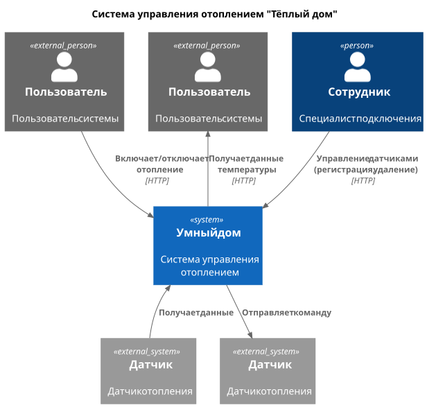
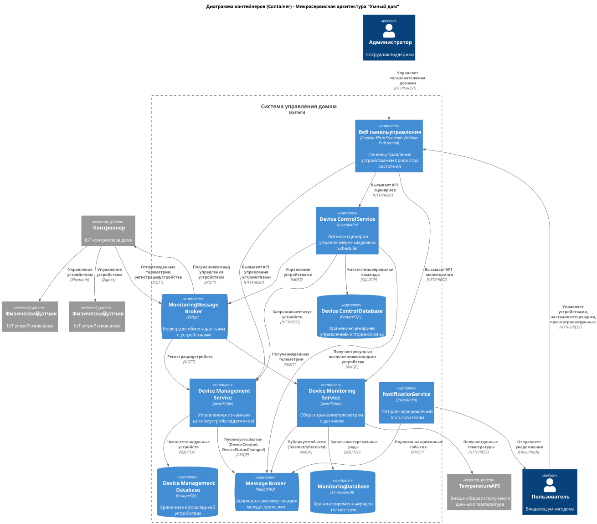
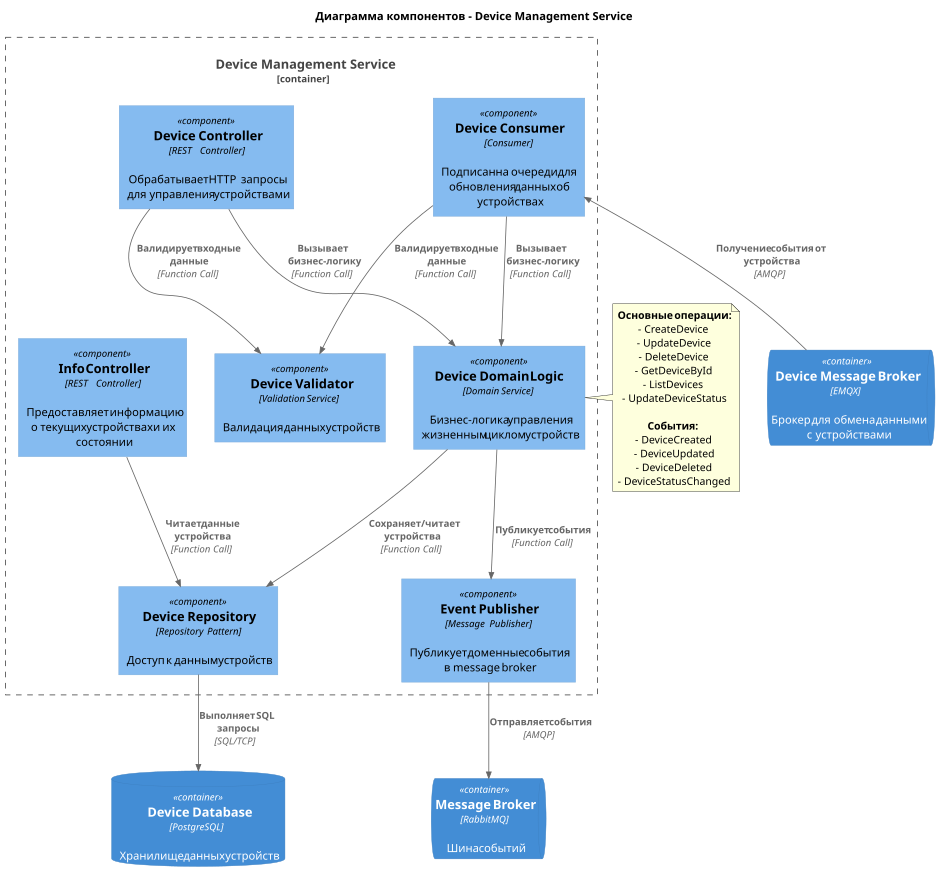

# Проектная работа 1 спринта

# Задание 1. Анализ и планирование

### 1. Описание функциональности монолитного приложения

**Управление отоплением:**

- Пользователи могут:
  - Удалённо включать отопление в доме
  - Удалённо выключать отопление в доме
  - Поддерживать заданную температуру в доме (путём периодического включения/отключения)
- Система поддерживает:
    - Создание датчиков
    - Обновление датчиков
    - Просмотр данных датчиков
- Через обновление значения датчика ( PATCH /sensors/:id/value ) можно изменять его статус и значение — это может использоваться для включения/выключения отопления
  - Например, если статус  active  — отопление включено,  inactive  — выключено

**Мониторинг температуры:**

- Пользователи могут:
  - Просматривать текущую температуру в доме (данные с датчиков) через веб-интерфейс
- Система поддерживает:
  - Получение показателей с датчиков температуры
- Приложение получает данные о температуре с внешнего API
- Поддерживает два способа получения данных:
  - По локации ( GET /api/v1/sensors/temperature/{location} )
  - По ID датчика ( GET /api/v1/sensors/{id} или при получении списка датчиков)
- Данные от внешнего API обновляют текущее значение датчиков в реальном времени


### 2. Анализ архитектуры монолитного приложения

- Язык программирования: Go
- База данных: PostgreSQL
- Архитектура: Монолитная, все компоненты системы (обработка запросов, бизнес-логика, работа с данными) находятся в рамках одного приложения.
- Взаимодействие: Синхронное, запросы обрабатываются последовательно.
- Межсистемное взаимодействие: RESTful API.
- Пользовательский интерфейс (UI): Web
- Масштабируемость: Ограничена, так как монолит сложно масштабировать по частям.
- Развёртывание: Требует остановки всего приложения.

### 3. Определение доменов и границы контекстов

**Домены**:
 - Управление Устройствами (Device Management)
   - **поддомен**: Управление отоплением (Heating Control)
     - **контекст**: Управление жизненным циклом датчиков (создание, обновление, удаление, изменение статуса)
 - Мониторинг температуры (Temperature Monitoring)
     - **поддомен**: Сбор и обработка данных с датчиков (Sensor Data Acquisition)
       - **контекст**: Получение, валидация, обновление и хранение данных с датчиков

### **4. Проблемы монолитного решения**

#### Основные проблемы:
 - Невозможно масштабировать отдельные компоненты
 - Простои при релизах. Нужно останавливать всё приложение для обновления
 - Трудно разделить работу над разными компонентами по командам и снизить их взаимное влияние
 - Доработки одного компонента требуют полного регрессионного тестирования всего приложения
 - Синхронное взаимодействие блокирует ресурсы при ожидании ответа. Повышаются требования к ресурсам.
 - Сбои в одном компоненте могут вызывать сбой в работе всего приложения (например, утечки памяти)
 - Общее хранилище. Невозможно выделить разные типы хранилищ под разные задачи и нагрузки

#### Дополнительные проблемы:
- Отсутствие чёткого разделения ответственностей (нарушение DDD и слоёв)
    > Логика работы с датчиками, интеграция с внешним API и обновление данных смешаны в одном обработчике
- Жёсткая зависимость от внешнего API температуры
    > При каждом запросе к  /sensors  или  /sensors/:id  система синхронно вызывает внешний  temperature-api
- Отсутствие изоляции поддоменов
    > Логика управления датчиками ( Sensor ) используется и для управления отоплением, но нет отдельной сущности  Thermostat  или  HeatingSystem
- Отсутствие аутентификации и авторизации
- Нет метрик и мониторинга приложения
- Отсутствие журналирования и аудита

### 5. Визуализация контекста системы — диаграмма С4



[Диаграмма контекста (PlantUML)](schemas/monolith_context.puml)

# Задание 2. Проектирование микросервисной архитектуры

**Диаграмма контейнеров (Containers)**



[Диаграмма контейнеров (PlantUML)](schemas/microservices_container.puml)

**Диаграмма компонентов (Components)**



[Диаграмма компонента Device Management Service(PlantUML)](schemas/device_management_service_component.puml)

**Диаграмма кода (Code)**

Добавьте одну диаграмму или несколько.

# Задание 3. Разработка ER-диаграммы

Добавьте сюда ER-диаграмму. Она должна отражать ключевые сущности системы, их атрибуты и тип связей между ними.

# Задание 4. Создание и документирование API

### 1. Тип API

Укажите, какой тип API вы будете использовать для взаимодействия микросервисов. Объясните своё решение.

### 2. Документация API

Здесь приложите ссылки на документацию API для микросервисов, которые вы спроектировали в первой части проектной работы. Для документирования используйте Swagger/OpenAPI или AsyncAPI.

# Задание 5. Работа с docker и docker-compose

Перейдите в apps.

Там находится приложение-монолит для работы с датчиками температуры. В README.md описано как запустить решение.

Вам нужно:

1) сделать простое приложение temperature-api на любом удобном для вас языке программирования, которое при запросе /temperature?location= будет отдавать рандомное значение температуры.

Locations - название комнаты, sensorId - идентификатор названия комнаты

```
	// If no location is provided, use a default based on sensor ID
	if location == "" {
		switch sensorID {
		case "1":
			location = "Living Room"
		case "2":
			location = "Bedroom"
		case "3":
			location = "Kitchen"
		default:
			location = "Unknown"
		}
	}

	// If no sensor ID is provided, generate one based on location
	if sensorID == "" {
		switch location {
		case "Living Room":
			sensorID = "1"
		case "Bedroom":
			sensorID = "2"
		case "Kitchen":
			sensorID = "3"
		default:
			sensorID = "0"
		}
	}
```

2) Приложение следует упаковать в Docker и добавить в docker-compose. Порт по умолчанию должен быть 8081

3) Кроме того для smart_home приложения требуется база данных - добавьте в docker-compose файл настройки для запуска postgres с указанием скрипта инициализации ./smart_home/init.sql

Для проверки можно использовать Postman коллекцию smarthome-api.postman_collection.json и вызвать:

- Create Sensor
- Get All Sensors

Должно при каждом вызове отображаться разное значение температуры

Ревьюер будет проверять точно так же.


# **Задание 6. Разработка MVP**

Необходимо создать новые микросервисы и обеспечить их интеграции с существующим монолитом для плавного перехода к микросервисной архитектуре. 

### **Что нужно сделать**

1. Создайте новые микросервисы для управления телеметрией и устройствами (с простейшей логикой), которые будут интегрированы с существующим монолитным приложением. Каждый микросервис на своем ООП языке.
2. Обеспечьте взаимодействие между микросервисами и монолитом (при желании с помощью брокера сообщений), чтобы постепенно перенести функциональность из монолита в микросервисы. 

В результате у вас должны быть созданы Dockerfiles и docker-compose для запуска микросервисов. 